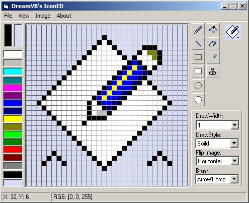



## DM IconEditor v1\.0

### Description

Hi this is a new version of my upcomming icon editor, at the moment it only supports 16 colors, but does come with much of the standerd drawing tools and some other features hope you like the first version.
 
### More Info
 

             |
---                |---
**Submitted On**   |2009-05-21 22:12:58
**By**             |[dreamvb](https://github.com/Planet-Source-Code/PSCIndex/blob/master/ByAuthor/dreamvb.md)
**Level**          |Beginner
**User Rating**    |5.0 (15 globes from 3 users)
**Compatibility**  |VB 6\.0
**Category**       |[Graphics](https://github.com/Planet-Source-Code/PSCIndex/blob/master/ByCategory/graphics__1-46.md)
**World**          |[Visual Basic](https://github.com/Planet-Source-Code/PSCIndex/blob/master/ByWorld/visual-basic.md)
**Archive File**   |[DM\_IconEdi2152885222009\.zip](https://github.com/Planet-Source-Code/dreamvb-dm-iconeditor-v1-0__1-72103/archive/master.zip)

